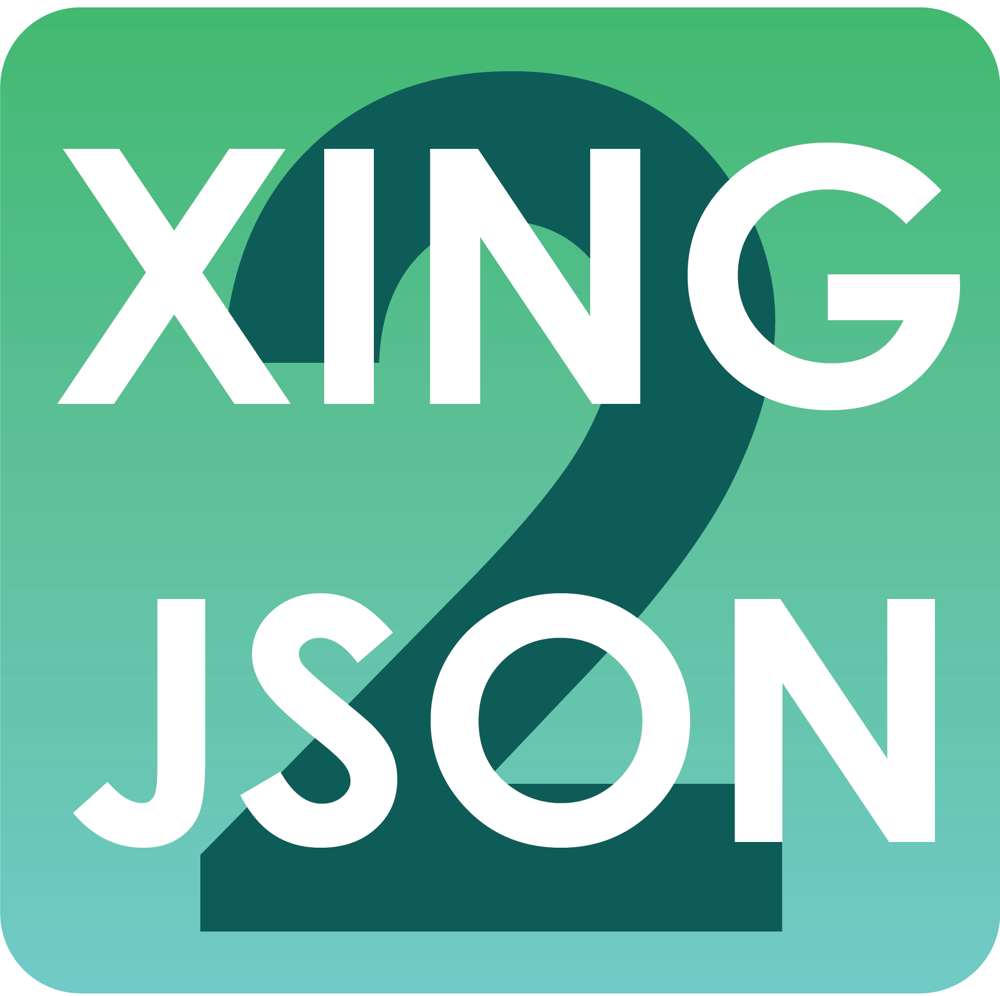

<p align="center">
    
</p>

<p align="center">
    
    
    
</p>

# Installation

## Chrome

```
$ NODE_ENV=production npm run build
```

Run this command and a directory called `build/` should appear, you can install it via going to the extension settings (three dots in the top right -> more tools -> extensions), turn the developer mode on (top right on the page) and then on load unpacked. And don't forget to run `npm i` beforehand.

# Development

Take a look [here](https://github.com/samuelsimoes/chrome-extension-webpack-boilerplate#webpack-auto-reload-and-hrm).

# ToDo

- [ ] don't allow generation if you're on "https://www.xing.com/profile/version/embedded/{username}/cv"
- [ ] release as version 0.0.1
- [ ] check if it's fully firefox compatible
- [ ] release to chrome and firefox store
- [ ] remove "\n" from strings (e.g. urls)
- [ ] check if the output violates the schema
- [ ] option to disable certain features (e.g. don't map languages)
- [ ] support more languages than de, en (used for locations)
- [ ] remove inline css
- [ ] better error handling (especially on async awaits)
- [x] change (default) icon(s)
- [ ] add warning that you need to be logged in
- [ ] make base icon fill out the whole image (no invisible borders)
  - [ ] generate all icons new based of the new base icon

## Data parsing

- Profile
  - [x] Name
  - [x] Image
  - [x] Location
  - [ ] Haves (maps to skills)
  - [x] Work experience
  - [x] Education
  - [x] Languages
  - [ ] Qualifications
  - [ ] Awards
  - [ ] Organisations (maps to volunteer)
  - [ ] Interests

# References

- [Chrome Extension Webpack Boilerplate](https://github.com/samuelsimoes/chrome-extension-webpack-boilerplate)

# Disclaimer

XING2JSON is in no way affiliated with XING SE. Nor should it be considered a product endorsed by XING SE.
